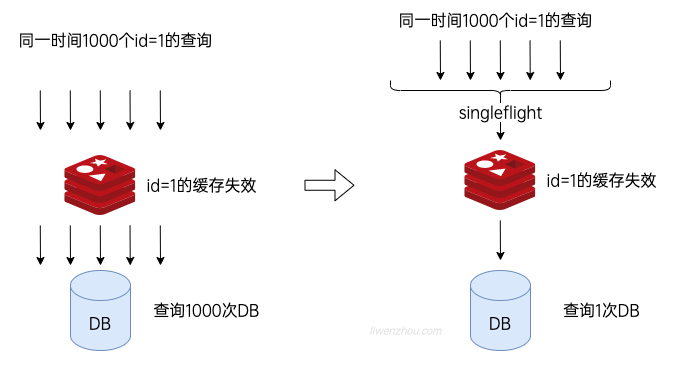

# tiny_cache

在使用缓存时，一定会存在缓存过期的情况。如果某一个热点数据过期，则会导致该请求对应的key未命中，并且这个请求量很大。这种现象我们称之为缓存穿透。
短期内大量请求未命中缓存，因此大量请求从数据源读取数据。

这时候如果使用singleflight,可以强制一个函数的所有后续调用等待第一个调用完成，以此减小db端的压力。而singleflight本质上是一个锁，
如果函数已经调用，后续调用都需要等待第一个调用执行完成然后将锁解开，读取第一次调用结果的缓存即可。



其次，下面的函数定义中，入参fn是一个回调函数，可以让调用者自定义数据读取逻辑。
```go
GetWithFn(ctx context.Context, key string, fn func() (interface{}, error)) (i interface{}, err error)
```